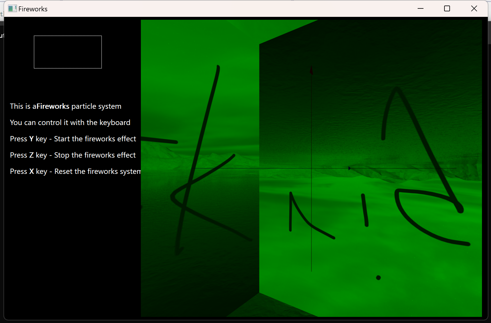

## Log
* 2024/12/18  dkn：烟花运行成功
* 2024/12/18  dkn: 增加功能，按住鼠标拖动即可实现烟花场景旋转
* 2024/12/19  dkn: 增加功能：按A/D让摄像机旋转；按W/S抬头低头；添加天空盒，但不知道为啥呈绿色（可能是颜色通道的问题，不过问题不大，这张图只是测试，之后会换的）；纹理贴图坐标还有一些错误待处理
* 2024/12/20 解决问题
* 

## 待完成事项
1. 天空盒实现
2. 摄像机旋转
3. ui设计（按左右键旋转摄像机）
4. 代码理解，粒子/烟花基于什么公式计算运动轨迹的？（物理模拟：粒子的运动采用经典的牛顿物理模型进行模拟，每个粒子受重力和空气阻力的影响）
5. 代码重构
## 以下为开题报告中我们提及的目标
1. 采用Blinn-Phong光照模型处理地面的光照效果，模拟地面对烟花爆炸的反射。
2. 模拟地面对烟花爆炸的反射。


## 一、概述

本实验将使用OPENGL实现烟花粒子系统和场景设计。

- 烟花粒子系统
- 天空盒设计
- 交互式移动摄像机视角
- 月球，飞船场景实现

## 二、技术路线与方案

### 1．粒子和烟花建模

- 需要用到的技术：点绘制

#### （1）烟花解构

烟花的爆炸效果通常是由许多粒子组成的。每一束烟花有多个粒子束，每一束烟花有多个粒子。粒子的运动和生命周期控制了烟花的动态效果。模拟的基本步骤包括：

- **初始化粒子**：每个粒子有初始位置、速度、颜色和生命周期。
- **粒子的运动**：通过`recount_points`计算粒子的运动轨迹。
- **粒子的寿命**：控制粒子的生命周期和爆炸后是否“死亡”。
- **粒子颜色和透明度管理**：随着时间推移，粒子的颜色和透明度变化，模拟烟花的衰减过程。

#### （2）粒子类

`Particle`类代表了烟花中的一个粒子束，有粒子束的多个性质

- `id`：用于表示粒子束在烟花的相对位置，从而计算粒子束的例子在空间中的绝对位置
- `radius`：半径
- `x0,y0,z0`：初始位置
- `coordinate`：保存该束粒子的所有坐标


下图是粒子运动轨迹分析图，Angle初始化为第一个粒子在该时刻的位置；每个粒子的角度递增step


`recount_points(int time)`：根据当前时间更新粒子的位置，模拟粒子从爆炸点出发后的运动轨迹。

```cpp
//负责绘制某一时刻轨迹中每个粒子的位置
void Particle::recount_points(int time){
    coordinate.clear();
    if(is_dying)
        return;
    if(lifetime<time)
        is_dying = true;

	//单独分析每一个粒子的二维运动
    float Angle = (time % 101) * 2 * M_PI / 100; //Angle初始化为第一个粒子的角度;一次调用recount_points
    float step = 2 * M_PI / 2400.0; //step表示每个粒子之间的角度差
    for (int i = 0; (i < length) && (Angle<=M_PI);i++){
        float x = radius - radius * cos(Angle);
        float y = radius * sin(Angle);
        float z = 0;
        //z = radius * sin(Angle);  // 使Z轴也有运动
		coordinate.append(QVector3D(x, y, z)); //将粒子的坐标加入到coordinate中，如果某些粒子的角度大于M_PI，则不再加入
        Angle += step; //粒子和粒子之间增加旋转角度
    }

	//将粒子的坐标转换到三维空间（利用id值）
    int n = coordinate.size();
	float theta = (2 * M_PI) / total; //theta表示每个粒子束之间的角度差
    for(int i = 0; i< n; i++){
        QVector3D newcoord = coordinate.at(i);
        coordinate[i].setX(newcoord.x()*cos(id*theta)+newcoord.z()*sin(id* theta)+x0);
        coordinate[i].setY(newcoord.y()+y0);
        coordinate[i].setZ(-newcoord.x()*sin(id* theta)+newcoord.z()*cos(id* theta)+z0);
    }
}
```

#### （3）Firework类

firework类是对particle类的封装，保存烟花的时间`time_c`，并根据粒子数量计算粒子的透明度alpha。粒子束中id越大的粒子透明度越大。

```cpp
float firework::get_alpha(int i, int j)
{
    int n = particles[i].coordinate.size();
    float del = 1 / (float)n;
    if (!particles[i].waiting_for_death()) {
        return j * del;
    }
    else {
        return (n - j) * del;
    }
}
```

#### （4）烟花场景绘画

我们使用点（GL_POINTS）模拟粒子的绘画，通过firework类中的方法获取粒子的位置/颜色/透明度等信息并画出点。

```cpp
void Widget::recountPoints() {
    glPushMatrix();
    //渲染多个火花或粒子系统的粒子，每个粒子都有位置、颜色和透明度。
    glPointSize(4);
    glBegin(GL_POINTS);

    for (int f = 0; f < fire.size(); f++) {
        //遍历每一个粒子
        if (timer.isActive())
        {
            fire[f].inc_time();
        }

        for (int i = 0; i < fire[f].particles_size(); i++) {
            fire[f].recount_particles(i);
            int n = fire[f].particles_coordinate_size(i);
            for (int j = 0; j < n; j++) {
                QVector3D newcoord = fire[f].particle_coordinate(i, j);
                QVector3D color = fire[f].get_particle_color(i, j);
                glColor4f(color.x(), color.y(), color.z(), fire[f].get_alpha(i, j));
                glVertex3f(newcoord.x(), newcoord.y(), newcoord.z());
            }
        }
    }
    glEnd();
    glPopMatrix();
}
```

### 2．天空盒场景实现

- 需要用到的技术：纹理加载与纹理贴图

#### （1）纹理加载

 要实现天空盒，我们首先需要将图片导入， 创建 OpenGL 纹理对象  。

使用 `QOpenGLTexture` 来创建纹理对象并设置纹理参数：

- **最小化滤波：** 设置为 `Linear`，即纹理缩小时使用线性插值。
- **放大滤波：** 设置为 `Linear`，即纹理放大时使用线性插值。
- **纹理包裹方式：** 设置为 `ClampToEdge`，即纹理超出范围时，颜色会被固定为边缘的颜色。

```cpp
void Widget::loadSkyboxTextures() {
    QString textureFiles[6] = {
        "./textures/right.jpg",  // 右
        "./textures/left.jpg",   // 左
        "./textures/top.jpg",    // 上
        "./textures/bottom.jpg", // 下
        "./textures/front.jpg",  // 前
        "./textures/back.jpg"    // 后
    };

    // 使用 QOpenGLTexture 来加载纹理
    for (int i = 0; i < 6; i++) {
        QImage img(textureFiles[i]);
        // 获取图像的格式
        QImage::Format format = img.format();

        // 输出图像的格式
        switch (format) {
        case QImage::Format_RGB888:
            qDebug() << "RGB format (no alpha channel)";
            break;
        case QImage::Format_RGBA8888:
            qDebug() << "RGBA format (with alpha channel)";
            break;
        case QImage::Format_RGB32:
            qDebug() << "RGB32 format (with alpha, 32-bit)";
            break;
        case QImage::Format_ARGB32:
            qDebug() << "ARGB32 format (with alpha, 32-bit)";
            break;
        default:
            qDebug() << "Other format";
        }
        img = img.convertToFormat(format);  // 确保纹理格式正确

        // 创建一个纹理对象并绑定
        QOpenGLTexture* texture = new QOpenGLTexture(img);
        texture->setMinificationFilter(QOpenGLTexture::Linear);
        texture->setMagnificationFilter(QOpenGLTexture::Linear);
        texture->setWrapMode(QOpenGLTexture::ClampToEdge);

        skyboxTextures[i] = texture;  // 保存纹理对象
    }
}
```

#### （2）场景绘制

之后我们需要绘制天空盒。

- 首先我们需要使用 glEnable(GL_TEXTURE_2D) 启用 2D 纹理映射。
- 禁用光照，这样天空盒就不会受光照影响
- 绘制六个面： 使用 `glBegin(GL_QUADS)` 和 `glEnd()` 绘制四边形，每个面绑定不同的纹理，并使用 `glTexCoord2f` 来设置纹理坐标。  
-  恢复光照和禁用纹理  

**值得注意的是**： 六个面的位置需要设定为白色`glColor3f(1.0f,1.0f,1.0f); `否则会默认为绿色，产生非常诡异的效果。

```cpp
void Widget::drawSkybox() {
    glPushMatrix();
    glLoadIdentity();
    glColor3f(1.0f,1.0f,1.0f); 
    // 禁用光照，这样天空盒就不会受光照影响
    glDisable(GL_LIGHTING);
    glEnable(GL_TEXTURE_2D); // Enable texture mapping
    // 绘制六个面，定义天空盒的大小
    float size = 300.0f;  // 天空盒的大小（根据需要调整）

    // 绘制前面
    skyboxTextures[4]->bind();  // 前面纹理
    glBegin(GL_QUADS);
    glTexCoord2f(0.0, 0.0); glVertex3f(size, size, size);
    glTexCoord2f(1.0, 0.0); glVertex3f(-size, size, size);
    glTexCoord2f(1.0, 1.0); glVertex3f(-size, -size, size);
    glTexCoord2f(0.0, 1.0); glVertex3f(size, -size, size);
    glEnd();

    // 绘制后面
    skyboxTextures[5]->bind();  // 后面纹理
    glBegin(GL_QUADS);
    glTexCoord2f(0.0, 0.0); glVertex3f(-size, size, -size);
    glTexCoord2f(1.0, 0.0); glVertex3f(size, size, -size);
    glTexCoord2f(1.0, 1.0); glVertex3f(size, -size, -size);
    glTexCoord2f(0.0, 1.0); glVertex3f(-size, -size, -size);
    glEnd();

    // 绘制上面
    skyboxTextures[2]->bind();  // 上面纹理
    glBegin(GL_QUADS);
    glTexCoord2f(0.0, 0.0); glVertex3f(-size, size, -size);
    glTexCoord2f(1.0, 0.0); glVertex3f(size, size, -size);
    glTexCoord2f(1.0, 1.0); glVertex3f(size, size, size);
    glTexCoord2f(0.0, 1.0); glVertex3f(-size, size, size);
    glEnd();

    // 绘制下面
    skyboxTextures[3]->bind();  // 下面纹理
    glBegin(GL_QUADS);
    glTexCoord2f(0.0, 0.0); glVertex3f(size, -size, -size);
    glTexCoord2f(1.0, 0.0); glVertex3f(size, -size, size);
    glTexCoord2f(1.0, 1.0); glVertex3f(-size, -size, size);
    glTexCoord2f(0.0, 1.0); glVertex3f(-size, -size, -size);
    glEnd();

    // 绘制左面
    skyboxTextures[1]->bind();  // 左面纹理
    glBegin(GL_QUADS);
    glTexCoord2f(0.0, 0.0); glVertex3f(-size, size, size);
    glTexCoord2f(1.0, 0.0); glVertex3f(-size, size, -size);
    glTexCoord2f(1.0, 1.0); glVertex3f(-size, -size, -size);
    glTexCoord2f(0.0, 1.0); glVertex3f(-size, -size, size);
    glEnd();

    // 绘制右面
    skyboxTextures[0]->bind();  // 右面纹理
    glBegin(GL_QUADS);
    glTexCoord2f(0.0, 0.0); glVertex3f(size, size, -size);
    glTexCoord2f(1.0, 0.0); glVertex3f(size, size, size);
    glTexCoord2f(1.0, 1.0); glVertex3f(size, -size, size);
    glTexCoord2f(0.0, 1.0); glVertex3f(size, -size, -size);
    glEnd();

    glDisable(GL_TEXTURE_2D); // Enable texture mapping
    glEnable(GL_LIGHTING);  // 恢复光照

    glPopMatrix();
}
```

### 3．摄像机移动与ui交互

**实现的功能有：**

摄像头自身的上下左右前后移动和旋转，通过按键控制。

通过鼠标拖动场景旋转。

**首先建立一个坐标系**

采用右手系，

通过`glBegin(GL_LINES);`来画出三条线段，`GL_TRIANGLES`画末尾的三角形

绿色的是z轴，红色的是y轴，蓝色的是x轴


有关相机的变量和函数放在widege.h中

- `**float pitch=0.0f, yaw=90.0f;**`

**功能**: 这两个浮点变量用于表示相机的俯仰角和偏航角。

**俯仰角 (Pitch)**: 控制相机上下的视角。0.0f 表示水平视角，正值向上倾斜，负值向下倾斜。

**偏航角 (Yaw)**: 控制相机左右的视角。90.0f 通常表示相机面向正右方。

- `**QVector3D\* worldUp;**`

**功**指向世界坐标系的“上”方向，通常用于计算相机的“上”方向。通常是(0, 1, 0)，表示Y轴向上。

- `**QVector3D\* cameraPosition;**`

相机在3D空间中的位置。包含相机的X、Y、Z坐标。

- `**QVector3D\* cameraLookat;**`

 相机所注视的点的坐标。这是相机要对准的目标点。

- `**QVector3D\* right;**`

 相机的右方向，通常是一个单位向量，用于计算相机的右侧平面。

- `**QVector3D\* cameraUp;**`

相机的上方向，通常是一个单位向量，用于确定相机的“上”方向，确保相机在3D空间中的方向正确。


两个关键函数：`void Widget::camera_move(int mode,float step)`

和`void Widget::camera_rotate(float xOffset, float yOffset)`

**摄像头平移：**

 假设 `cameraPosition` 表示相机的位置向量 ,`cameraLookat` 表示相机注视点的向量 ，`front` 表示相机的前方向量，`right` 表示相机的右方向量，`cameraUp` 表示相机的上方向量，`step` 是移动步长。  


计算`front`向量:


前进后退：


向左、右平移


向上、下平移


```cpp
void Widget::camera_move(int mode,float step) {
    QVector3D front = *cameraLookat - *cameraPosition;
    // 更新相机的位置
    QVector3D delta;
    switch (mode)
        {
            case 0:
                delta = { front.x() * step, front.y() * step, front.z() * step };
                *cameraPosition += delta;
                *cameraLookat += delta;
                break;
            case 1:
                delta = { front.x() * step, front.y() * step, front.z() * step };
                *cameraPosition -= delta;
                *cameraLookat -= delta;
                break;
            case 2:

                delta = { right->x() * step, right->y() * step, right->z() * step };
                *cameraPosition += delta;
                *cameraLookat += delta;
                break;
            case 3:
                delta = { right->x() * step, right->y() * step, right->z() * step };
                *cameraPosition -= delta;
                *cameraLookat -= delta;
                break;
            case 5://up
                delta = { cameraUp->x() * step, cameraUp->y() * step, cameraUp->z() * step };
                *cameraPosition += delta;
                *cameraLookat += delta;
                break;
            case 6://down
                delta = { cameraUp->x() * step, cameraUp->y() * step, cameraUp->z() * step };
                *cameraPosition -= delta;
                *cameraLookat -= delta;
                break;
            default:
                break;
        }
}
```

**摄像头旋转：**

**更新角度**:
假设 `yaw`和`pitch`是相机的偏航角和俯仰角。更新公式为：


确保俯仰角在合理范围内(-89度~89度）


使用极坐标转换为笛卡尔坐标表示相机的前向量：

转为弧度制


计算前向量:


归一化:


根据点积的右手定则可以得到相机的右方向


 最后，更新相机的注视点： 


```cpp
void Widget::camera_rotate(float xOffset, float yOffset)
{

    //更新俯仰角，偏航角角度
    yaw += xOffset;
    pitch += yOffset;

    if (pitch > 89.0f) pitch = 89.0f;
    if (pitch < -89.0f) pitch = -89.0f;
    //更新摄像机坐标系
    QVector3D tmp(.0f,.0f,.0f);
    tmp.setX(std::cos(radian(yaw)) * std::cos(radian(pitch)));
    tmp.setY(std::sin(radian(pitch)));
    tmp.setZ(std::sin(radian(yaw)) * std::cos(radian(pitch)));
    tmp.normalize();
    QVector3D front = tmp;
    *right = QVector3D::crossProduct(front, *worldUp).normalized();
    *cameraUp = QVector3D::crossProduct(*right, front).normalized();
    *cameraLookat = *cameraPosition + front;

}
```

最开始的时候，我是让相机绕原点旋转的，而非让相机自己上下左右旋转，注视点也始终是原点，后来发现这种方式没有以观看者为中心，所有改为了一个更加符合游戏中的旋转方式，即以相机自己为中心旋转。平移最开始是直接改绝对位置坐标，如front是x轴正向，但是这种实现效果很奇怪，所有就改为以lookat的方向为front的方向进行平移。

添加一些按键进行控制

```cpp
    case Qt::Key_J: glwidget->camera_rotate(-2,0); break;//左转
    case Qt::Key_L: glwidget->camera_rotate(2,0); break;//右转
    case Qt::Key_I: glwidget->camera_rotate(0, 1); break;//上转
    case Qt::Key_K: glwidget->camera_rotate(0, -1); break;//下转

    case Qt::Key_A: glwidget->camera_move(3, step); break;  // 向左移动
    case Qt::Key_D: glwidget->camera_move(2, step); break;   // 向右移动
    case Qt::Key_U: glwidget->camera_move(5, step); break;   // 向上移动
    case Qt::Key_N: glwidget->camera_move(6, step); break;  // 向下移动
    case Qt::Key_W: glwidget->camera_move(0, step); break;  // 向前移动
    case Qt::Key_S: glwidget->camera_move(1, step); break; // 向后移动
```

通过按住鼠标拖动来旋转

```cpp
void MainWindow::mouseMoveEvent(QMouseEvent *e) {
    //拖动鼠标可以实现摄像头旋转，就好像拖动天空盒在转
    if(e->x()<235||e->x()>815)
        return;
    if(e->y()<5||e->y()>500)
        return;

    if (e->buttons() & Qt::LeftButton) {
        glwidget->camera_rotate((x0-e->x())/100, (e->y()- y0) / 100.0);

    }

}
```

### 4．月球，飞船场景实现

#### （1）模型加载

##### 1.初始化对象

1. 通过创建一个`QFile`对象`file`，并使用提供的`filePath`（文件路径）初始化来读写文件。
2. 以只读模式（`QIODevice::ReadOnly`）打开文件。如果文件成功打开，创建一个`QTextStream`对象`stream`，并将其与已打开的`file`对象关联。`QTextStream`是Qt中用于在文本文件中进行读写操作的类，它提供了基于流的接口，可以方便地读取和写入文本数据。
3. 声明一个`QString`对象`line`，用于存储从文件中逐行读取的数据。

##### 2.解析Obj文件

1. **解析顶点坐标（**`**v** `**）**：

- - 如果行以`v `开头，则解析顶点的`x`、`y`、`z`坐标。
  - 根据`id`的值对顶点坐标进行缩放和平移变换（这里`id`的值和含义在代码片段之外定义）。
  - 将解析出的顶点坐标添加到`vertices`容器中。

1. **解析纹理坐标（**`**vt** `**）**：

- - 如果行以`vt `开头，则解析纹理的`u`、`v`坐标。
  - 将解析出的纹理坐标添加到`texCoords`容器中。

1. **解析法向量（**`**vn** `**）**：

- - 如果行以`vn `开头，则解析法向量的`nx`、`ny`、`nz`分量。
  - 将解析出的法向量添加到`normals`容器中。

1. **解析面（**`**f** `**）**：

- - 如果行以`f `开头，则解析面的定义。
  - `.obj`文件中的面定义可能包含顶点索引、纹理索引和法线索引。
  - 将解析出的索引（减去1，因为`.obj`文件中的索引是从1开始的，而大多数编程环境中的数组索引是从0开始的）添加到`indices`容器中。

```cpp
// 解析文件内容
while (!stream.atEnd()) {
    line = stream.readLine().trimmed();

    if (line.startsWith("v ")) {
        // 解析顶点坐标
        QStringList parts = line.split(" ");
        float x = parts[1].toFloat();
        float y = parts[2].toFloat();
        float z = parts[3].toFloat();
        if (id == 3) //帆船，先缩小模型后移动位置
        {
            x /= 20; x += 10; 
            y /= 20; y -= 10;
            z /= 20;
        }
        if (id == 2)//月亮，放大2倍并移动位置
        {
            x *= 5;
            x -= 20;
            y *= 5;
            y += 20;
            z *= 5;
        }
        vertices.append(QVector3D(x, y, z));
    }
    else if (line.startsWith("vt ")) {
        // 解析纹理坐标
        QStringList parts = line.split(" ");
        float u = parts[1].toFloat();
        float v = parts[2].toFloat();
        texCoords.append(QVector2D(u, v));
    }
    else if (line.startsWith("vn ")) {
        // 解析法向量
        QStringList parts = line.split(" ");
        float nx = parts[1].toFloat();
        float ny = parts[2].toFloat();
        float nz = parts[3].toFloat();
        normals.append(QVector3D(nx, ny, nz));
    }
    else if (line.startsWith("f ")) {
        // 解析面
        QStringList parts = line.split(" ");
        for (int i = 1; i < parts.size(); ++i) {
            QStringList vertexParts = parts[i].split("/");
            indices.append(vertexParts[0].toInt() - 1);  // 顶点索引
            if (vertexParts.size() > 1)
            {
                indices.append(vertexParts[1].toInt() - 1);  // 纹理索引
                if (vertexParts.size() > 2) 
                indices.append(vertexParts[2].toInt() - 1);  // 法线索引
            }
        }
    }
}
```

##### 3.加载纹理

采用QOpenGLTexture(QImage(texturePath).mirrored()函数加载纹理进变量texture中

#### （2）模型绘制（包含Blinn-Phong Shading实现)

##### 1.绑定纹理，开启纹理映射

```cpp
if (texture3) {
    texture3->bind();  // 绑定纹理
}
```

在bind函数中，会做：

1. **设置纹理单元**：在OpenGL中，有多个纹理单元可用于同时绑定多个纹理。`bind()`函数会指定一个纹理单元作为参数（在这个简化的例子中并没有显示）
2. **更新硬件状态**：`bind()`函数会更新图形硬件的状态，以便在后续的渲染调用中使用新绑定的纹理。这通常涉及将纹理的内存地址、格式和其他相关信息发送给GPU。
3. **准备着色器采样**：在着色器中，采样器（sampler）用于访问纹理数据。绑定纹理后，着色器中的采样器将能够访问与该纹理相关联的数据。

##### 2.实现加载纹理下的Blinn-Phong Shading

1. **传入烟花的光源位置，颜色，以及摄像机lookat方向**
2. **设定镜面系数，环境光颜色，材质颜色**
3. **启用纹理映射**
4. **循环遍历每个顶点进行计算着色：**

##### 3.注意点：

1. 这里要用到前一步标签为"f"时的索引数组，每三个索引为一组，一组中第一个索引是顶点数组的索引，第二个索引是这个顶点的纹理坐标在纹理数组中的索引，第三个索引是这个顶点对应的法向量在法向量数组中的索引，根据索引获得了这些坐标以后就可以进行着色的计算了
2. 因为引入了纹理，需要注意在最后绘制顶点之前要调用glTexCoord2f(texCoords[texCoordIndex].x(), texCoords[texCoordIndex].y());来计算纹理坐标并绑定纹理

```cpp
for (int i = 0; i < indices.size(); i += 3) {
    int vertexIndex = indices[i];
    int texCoordIndex = indices[i + 1];
    int normalIndex = indices[i + 2];

    QVector3D normal = normals[normalIndex];
    QVector3D vertex = vertices[vertexIndex];
    //注意，由于camera_position定义时是以（0,0,0）旋转的，所以实际上canmera_position就是cameralookat，云皓如果改了逻辑要重新看

    // 计算光照（Blinn-PhongShading模型）
    //vec3 parallel = CalcDirLight()
    //片元指向光源方向
    QVector3D lightDir = QVector3D(lightPos[0] - vertices[vertexIndex].x(), lightPos[1] - vertices[vertexIndex].y(), lightPos[2] - vertices[vertexIndex].z());  // 光源方向（假设在(1,1,1)位置）
    lightDir.normalize();

    // 计算法线和光源方向的点积，得到漫反射光强
    GLfloat diffuse = std::max(QVector3D::dotProduct(normal, lightDir), 0.0f);
    QVector3D diffuseComponent = diffuse * color * materialColor;
    GLfloat diff[] = { diffuseComponent.x(),diffuseComponent.y(),diffuseComponent.z(),1.0f };
    glLightfv(GL_LIGHT0, GL_DIFFUSE, diff);  // 漫反射光
    //计算镜面反射部分
    QVector3D halfDir = lightDir + viewDir;//半角向量
    halfDir.normalize();
    GLfloat specular = std::pow(std::max(QVector3D::dotProduct(normal, halfDir), 0.0f), specularExponent);
    QVector3D specularComponent = specular * color * materialColor;
    GLfloat spec[] = { specularComponent.x(),specularComponent.y(),specularComponent.z(),1.0f };
    glLightfv(GL_LIGHT0, GL_SPECULAR, diff);
    
    // 最终光照强度，累加环境光、漫反射和镜面反射
    QVector3D totalLight = diffuseComponent + specularComponent + ambientComponent;
    // 计算纹理坐标
    glTexCoord2f(texCoords[texCoordIndex].x(), texCoords[texCoordIndex].y());
    
    // 计算最终顶点颜色（简单的光照颜色：漫反射*材质颜色）
    GLfloat finalColor[] = { totalLight.x(), totalLight.y(), totalLight.z(), 1.0f };
    glColor3fv(finalColor); // 设置颜色（使用光照计算结果）

    // 绘制顶点
    glVertex3f(vertex.x(), vertex.y(), vertex.z());
```

#### （3）在主函数调用过程中的注意事项：

当想要移动模型位置来看不同角度下光照效果时不能直接在draw函数之外调用：


因为计算光照效果shading时是在draw函数内部，此时并没有进行移位，因此想要移位模型的同时产生正确的光照效果，需要在darw函数内部进行顶点的变换

## 三、实验效果


